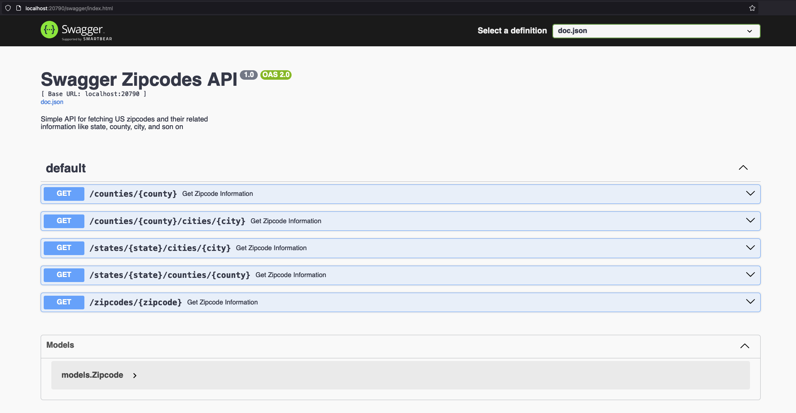

    <h1 align="center">US Zipcodes API</h1>
    
An API server for fetching US zipcodes.

     
    

        
    

## Description
A simple API to fetch the US zipcodes(2000 census) and their associated information in differet ways.

The goal for creating this project is for practicing, and this API is not intended for commercial use, only for educational purposes.

## Dependencies

To execute this API you will need to have installed the following software:
* `Golang` version `1.22.7` or higher
* `Docker`
* `Docker compose`

The minimum requirement will be a `Golang` version `1.22.7` or higher installed to run the API server with the build-in database.

## Usage

The API server can be executed using `make`or compiling the server  and executed it.  

To see the avalaible `make` commands you can execute `make help`

For using `make` you have to have `make` or any compatible variant already installed on your system.

### Running the API Server with a MySQL database

For running the API server with a MySQL database as the backend storage, you have to have a `.env` locally at the root of this repository and already have installed Docker and Docker compose.

The `.env` file must contain the following environemtn variables:

* `MYSQL_ROOT_PASSWORD`
* `MYSQL_DATABASE`
* `MYSQL_USER`
* `MYSQL_DATABASE`
* `MYSQL_PASSWORD`

Then you have to run the command

`make compose-mysqldb start-mysqldb` or simply `make start-mysqldb`

### Running the API Server with a MongoDB database

For running the API server with a MongoDB database as the backend storage, you have to have a `.env` locally at the root of this repository and already have installed Docker and Docker compose.

The `.env` file must contain the following environemtn variables:

* `MONGODB_USERNAME`
* `MONGODB_PASSWORD`
* `MONGODB_DATABASE`
* `MONGODB_COLLECTION`

Then you have to run the command

`make compose-mongodb start-mongodb` or simply `make start-mongodb`

### Compiling the API server

To compile the API server, you can execute one of the following commands:

* `go build -o <binary-name> ./cmd/zipcodes`
* `make compile`

The first one is for compile and get a binary specific for you current machine, the second one is for creating binaries for different OS and architectures(arm, 386, amd64) in the the local `bin/` directory.

## Testing the API Server

You could compile and run the server or use Docker to create the service in any of the different ways, then when the API server is up and running you can visit the endpoint `/swagger/index.html` to check the online Swagger documentation and test some values in the different endpoints.

    

## Populating the database

The population of the database is automated, downloading the US zipcodes from the CSV file created by [scpike](https://github.com/scpike) in the following repository [link](https://github.com/scpike/us-state-county-zip).

After the API server is up and running, the following endpoints will be available at port `:20790`:

* `/zipcodes/{zipcode}`
* `/counties/{county}`
* `/states/{state}/counties/{county}`
* `/states/{state}/cities/{city}`
* `/counties/{county}/cities/{city}`

You can see how to fetch data form the server in the following demo:

    

Here are the `curl` examples shown in the gift demo:

* `curl -i http://localhost:20790/zipcodes/90001`
* `curl -i http://localhost:20790/counties/Sampson`
* `curl -i http://localhost:20790/states/North%20Carolina/counties/Mecklenburg`
* `curl -i http://localhost:20790/states/Virginia/cities/Ivor`
* `curl -i http://localhost:20790/counties/Cook/cities/Rosemont`

### TO-DO

* [x] Add Swagger API documentation
* [ ] Add code documentation (Structuctures, Functions, Interfaces, etc)
* [ ] Add automated tests
* [ ] Normalize the MYSQL datatabase
* [ ] Set up dynamically the API server port to use
* [x] Add MongoDB database connection
* [ ] Add some GitHub actions to automate tasks
* [ ] Deploy the app to a local Kubernetes environment
* [ ] Deploy the service to a Kubernentes cloud environment