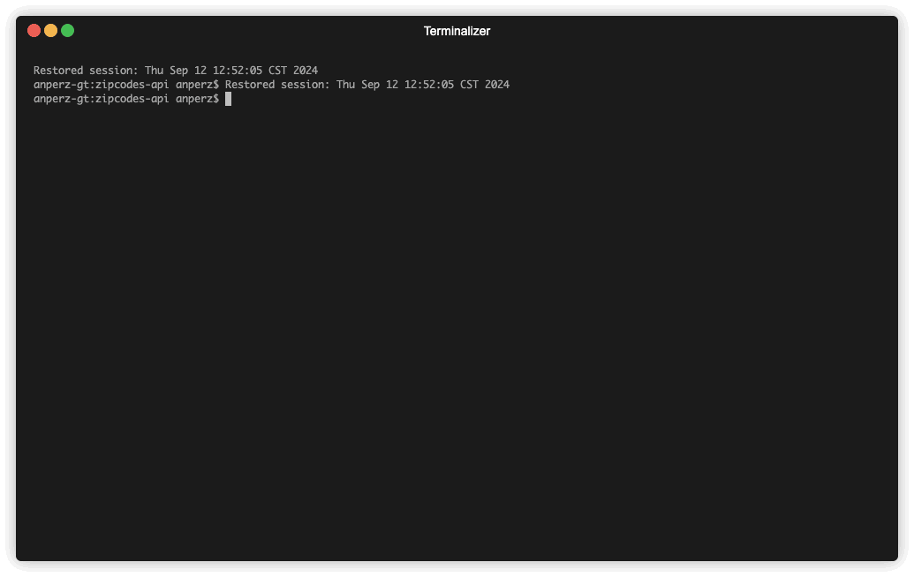
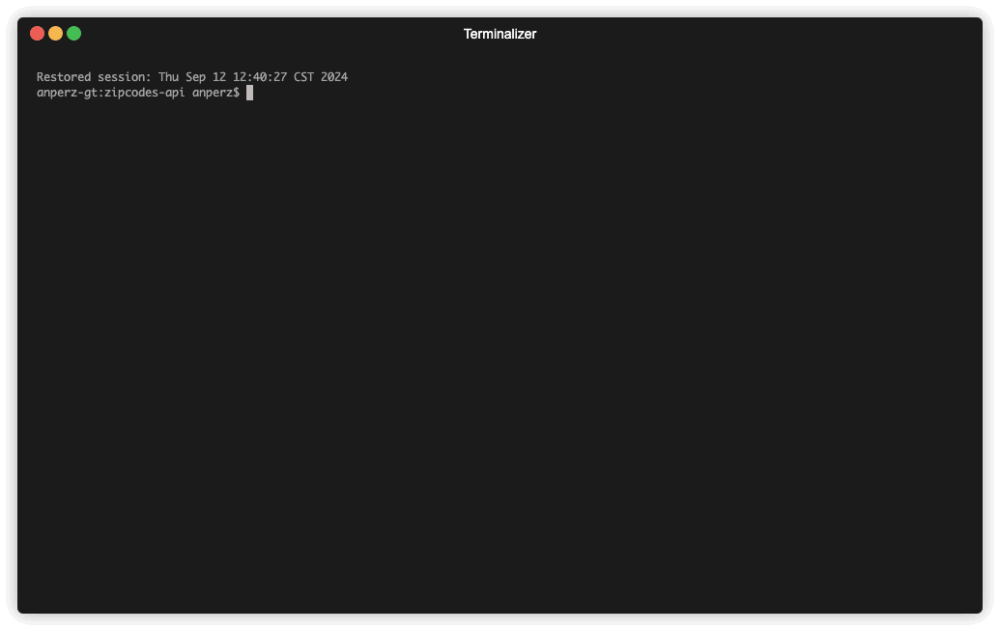
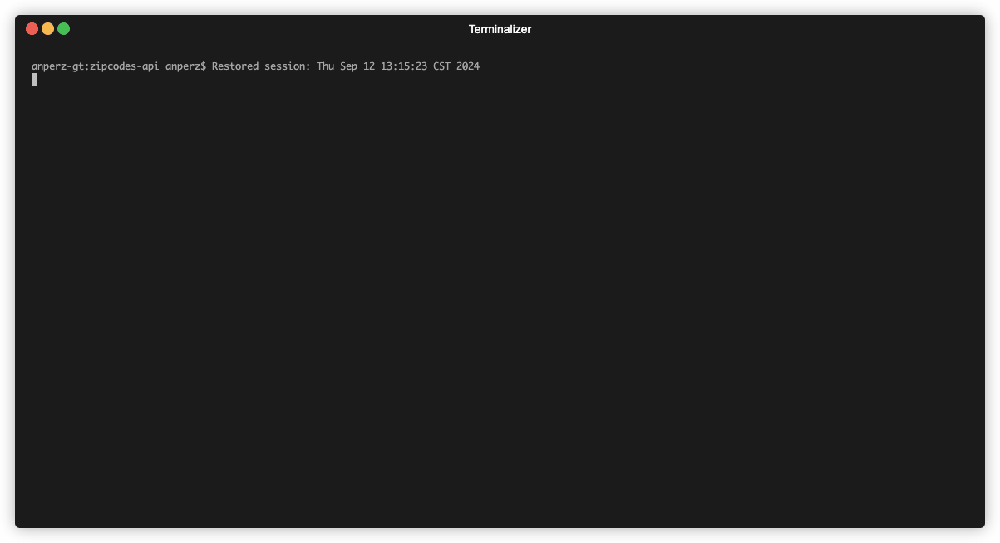

    <h1 align="center">US Zipcodes API</h1>
    
A simple API to fetch teh US zipcodes and their associated information in differet ways

     
    

        
    

## Description
This API is intended to fetch the US postal codes and its associated information such as: state, state abbreviation, county, and city.

The main goal for creating this project was for practicing a bit some old concepts and some new ones, and this API is not intended for commercial use, only with educational purposes.

## Usage

The API server could be use running one of the docker compose files, then you will require Docker and docker compose to run the project.

By this time, the API is implemented with an in memory database which is a nested map structure, and with a MySQL database.

* The `docker-compose.local.yaml` file will create the API server container with an in memory database, which is a nested map structure to hold the US Zipcodes
* The `docker-compose.mysql.yaml` file will create a `MySQL` dabatase container and the API server container.

The interaction is the same, and for both approaches the pupulation of the database is automated, downloading the US zipcodes from the CSV file created by [scpike](https://github.com/scpike) in the following repository [link](https://github.com/scpike/us-state-county-zip).

After the APi server is up and running, the following endpoints will be available:

* `/zipcodes/{zipcode}`
* `/counties/{county}`
* `/states/{state}/counties/{county}`
* `/states/{state}/cities/{city}`
* `/counties/{county}/cities/{city}`

The default port is `:20790` and by this moment there is no automated option to chnage it, but if you want to use another port you have to update one of the docker compose files with the port you wa to use.

You can see how to run the API server and fetch data in the following demos:

## TO-DO

* [ ] Add tests
* [ ] Automate the port to use config
* [ ] Add MongoDB database connection
* [ ] Add GitHub actions to automate tasks
* [ ] Deploy the app to a local Kubernetes environemnt
* [ ] Deploy the service to a Kubernentes cloud environment